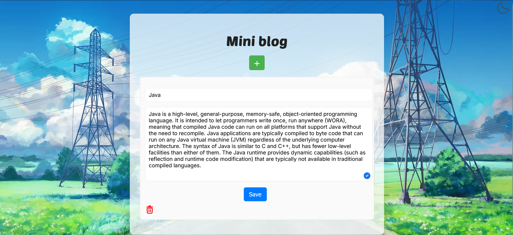
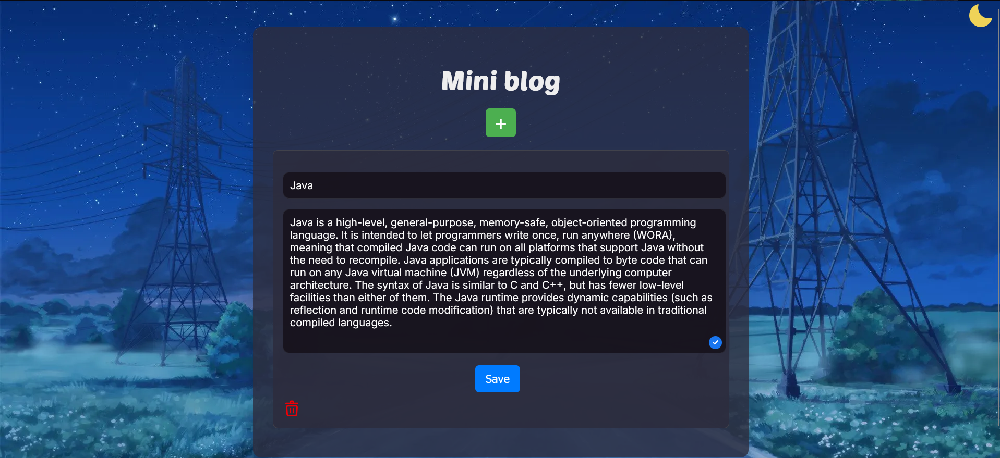

<div align="center">

</div>

### Language and frameworks:
* Python 
* Flask 
* Html 
* Css 

### Preview:



### Install repository:

```
git clone https://github.com/titanilham/CourseWorkDateBase.git
```

### Module installation:

```
pip install -r requirements.txt
```

### Launching the app:

```
cd .\CourseWorkDateBase\
python app.py
```

----

<div id="badges">
  <a href="https://vk.com/aniime_guy" >
    
  </a>
  <a href="https://t.me/Ilham06">
    
  </a> 
  <a href="https://www.youtube.com/channel/UC9m1N5x0OXWihGpR50Yk35g">
   
  </a>
  <a href="https://discord.com/channels/1019531122239094794/1019531122239094801">
    
  </a>
</div>
